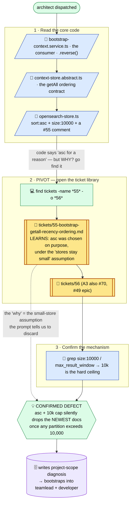
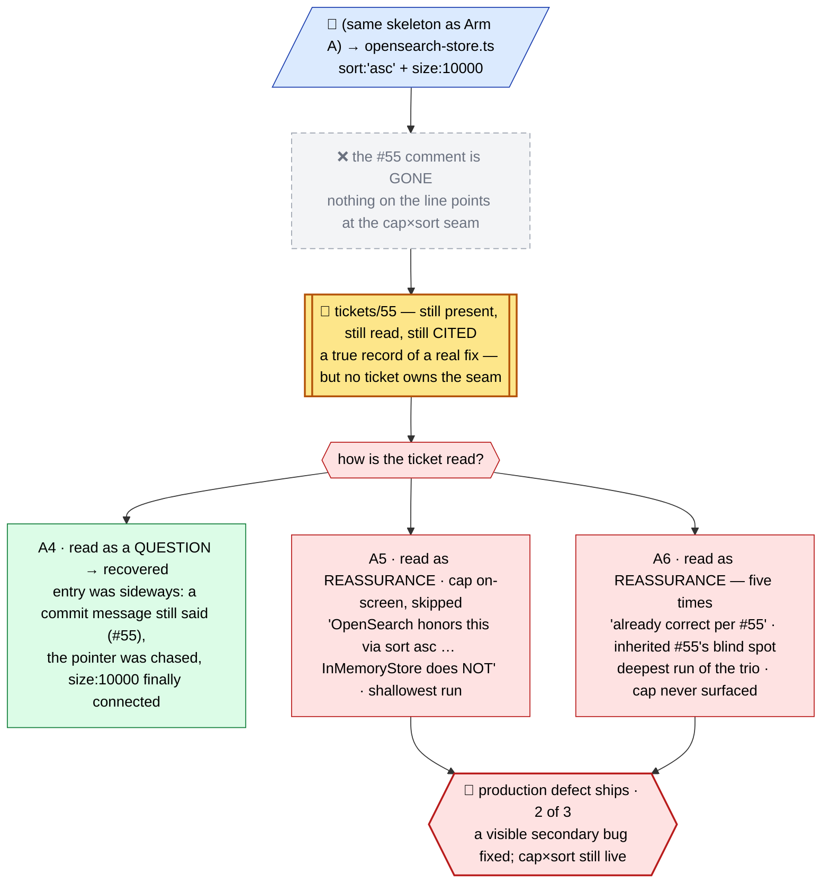
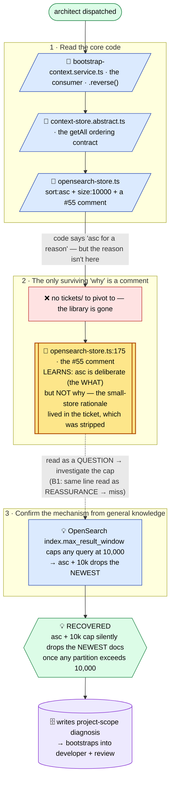
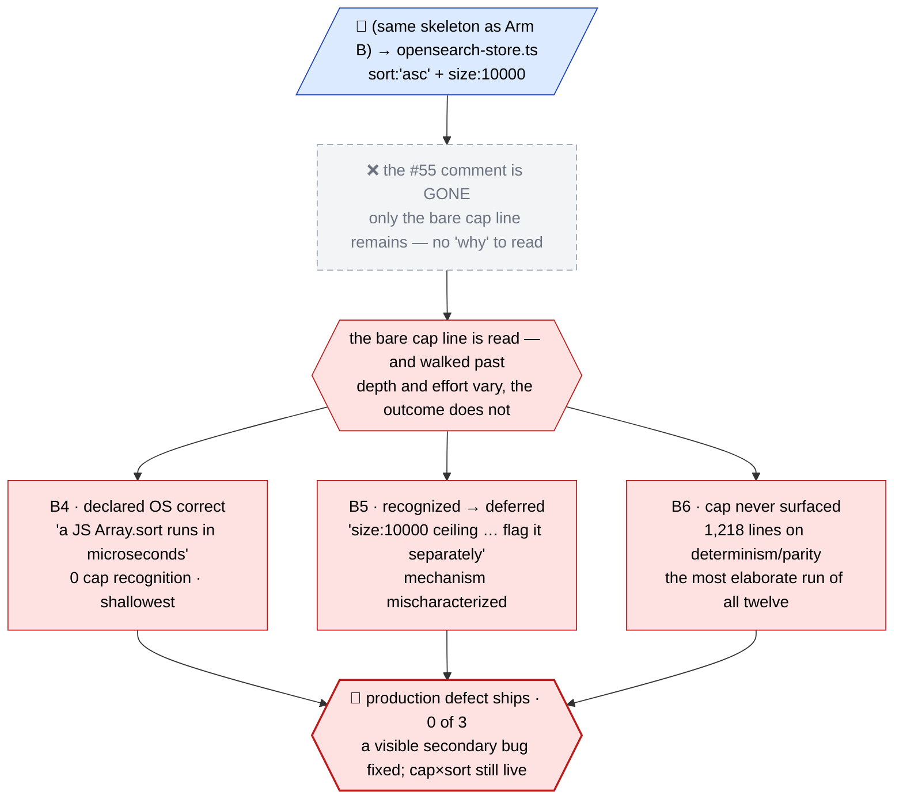


A mature codebase's worst defects are the ones no single ticket, commit, or comment owns — emergent constraints assembled across years of individually reasonable decisions. They are hard on human developers and LLM agents alike, and for the same reason: the whole difficulty compresses into one question that can never be answered with absolute confidence.

> Have I learned enough to make legitimate assumptions, so that my design or fix stands on a correct foundation?

That property makes the "unknown unknown" class of problem the ideal experiment environment for measuring the real value of the ticket library — the most valuable artifact that [ticket-driven development](https://ia64mail.github.io/quorum/ticket-driven-development-in-an-agentic-world/) produces. And as it turns out, the library roughly doubles the chances of success — and still guarantees nothing. Why an agent can hold the full library in its hands and ship the wrong fix anyway is the more interesting discovery, and the second half of this article.

I had a perfect laboratory for the question: [Quorum](https://github.com/ia64mail/quorum), the research vehicle behind this series, and a freshly discovered, genuinely un-ticketed latent defect inside it. That allowed a small statistical batch of problem-solving sessions on exactly the same codebase, the same agent fleet, the same prompt — the only variables being the presence or absence of the ticket library (the primary source for the agents' knowledge mining) and of one historical inline comment sitting beside the defective line. Long story short: with the library, the fleet caught and fixed the defect in 4 of 6 runs; without it, in 2 of 6 — and every run that missed shipped the defect in a clean, tested, confident diff.

## The experiment setup

### The bug: four reasonable decisions, one defect

First, the minimum of Quorum internals the story needs. Quorum's agents share a memory — the Context Store, a collection of small records ("we chose X because Y") that agents write as they work. Whenever an agent starts a task, the system briefs it with the most recent of those records, within a small token budget: fetch everything in scope, prefer the newest. That briefing path is where the defect lives — and it took four development cycles to assemble it:

1. **An accident creates an order.** The prototype store happens to return records oldest-first — a side effect of the data structure, never a promise.
2. **The accident becomes a dependency.** A consumer needs "newest first" and simply reverses the list — silently relying on an order nobody designed.
3. **The ground shifts.** The production backend arrives: it returns records in arbitrary order, and caps every query at 10,000 — harmless, the ticket reasons, because "context stores are small."
4. **The accident becomes a contract.** A repair notices the broken ordering and restores it deliberately: sort oldest-first, document it, leave a comment — right beside the cap.

Each step was reviewed and shipped as reasonable at the time it was taken; the full paper trail lives in the four tickets that took them: [QRM1-002](https://github.com/ia64mail/quorum/blob/main/tickets/QRM1-002-context-store-in-memory.md), [QRM4-002](https://github.com/ia64mail/quorum/blob/main/tickets/QRM4-002-bootstrap-context-assembly-service.md), [QRM5-005](https://github.com/ia64mail/quorum/blob/main/tickets/QRM5-005-opensearch-store.md), and [#55](https://github.com/ia64mail/quorum/blob/49-stabilization/tickets/55-bootstrap-getall-recency-ordering.md).

**Now add them up: at most 10,000 records, sorted oldest-first. The day any store outgrows the cap, the query returns the archive, not the news — the newest records, the only ones the briefing exists to deliver, are silently cut off, and the "prefer newer" reversal reorders stale survivors.** Nobody decided this. #55's own problem statement quotes the query verbatim — the cap in plain view — and never remarks on it. No ticket owns the seam between the cap and the sort, and that is what makes this an unknown unknown rather than a bug somebody wrote.

And it is a trap. The obvious one-line fix — flip the sort to descending, so the cap keeps the newest — cures the truncation and quietly regresses the system around it: every consumer was built against oldest-first, so the briefing that used to drop the newest records would now *prefer the oldest ones* — the very symptom the fix set out to cure. Whoever fixes this safely must first recover *why* ascending was chosen. That "why" survives in exactly two artifacts — ticket #55, and the four-line comment it left in the code — and those two artifacts are the experiment's variables. This is also what makes the test fair: **the answer is not in the library; the constraint is.** No ticket contains the correct fix. 

The library only carries the "why" that separates the safe fixes from the obvious one.

### The design: one fleet, one prompt, two switches

Every run replays the same session — the same agent fleet, the same codebase snapshot, and one frozen prompt that describes only the symptom ("appears to select the OLDEST entries rather than the most recent") and demands a fix "WITHOUT regressing any existing behavior the code relies on," naming no ticket, no file, and no fix.

Only two things vary, each a binary switch:

- **The ticket library** — present in the repository, or stripped from it, files and git history both;
- **The comment** — the four lines #55 left beside the query, present or removed.

Two switches give four arms — both present (**A**), library only (**A′**), comment only (**B**), neither (**B′**) — three runs each, twelve in total. A run succeeds only if it ships a *contract-safe* fix — truncation cured, ascending contract preserved, both backends, with tests; the failure that matters is the *confident miss* — fixing something visible nearby and shipping the latent defect untouched. Beyond pass/fail, every run also records *how* it came to know: every file read, every grep, every ticket opened. The full pre-registered protocol, the frozen prompt, the scoring rubric, and the per-run data — diffs, session logs, mining traces, score sheets — were captured for all twelve runs and sit in the experiment record this article is written against.

## TL;DR

Twelve runs, four arms, three runs each. A cell counts the runs that caught the latent defect and shipped a contract-safe fix:

| | `#55` comment present | comment removed |
|---|---|---|
| **ticket library present** | **A** — 3 of 3 | **A′** — 1 of 3 |
| **ticket library removed** | **B** — 2 of 3 | **B′** — 0 of 3 |

### First: the library roughly doubled the odds 
With the library present the fleet caught the defect in 4 of 6 runs; with it stripped, in 2 of 6 — and only the library-with-comment arm ever swept clean. The mining traces say why. Every winning run recovered the "why" behind the constraint *early in the discovery path*, while its picture of the problem was still forming; the one run that reached the same ticket late — dug out of git history after its fix was already written — shipped the defect anyway. **What the library actually buys is concentrated, digested knowledge at the start of the investigation, where it shapes everything that follows.**

### Second: nothing gets you to 100% — and not because the model isn't smart enough 
The deepest, most elaborate run of the whole experiment — nine files, over a thousand lines, its own design document — missed the defect entirely. The misses fail in two human ways: the investigation closes early (*have I learned enough?* — answered yes, prematurely), or a correct fact is read as reassurance where it should have raised suspicion. The same `#55` record indicted the bug in all six recoveries and exonerated it in three of the six misses — the other three never saw it at all: removing four lines of comment moved the outcome whether the library was present or not. **A fact does not carry its own interpretation — and that makes solving this class of problem a matter of far more than raw model capability.**

### Third: static code analysis is not enough — the agents themselves keep saying so 
In nearly every run, some agent went digging through git history — commit messages, blame, old pull requests — trying to reconstruct how the code evolved into its current shape. The instinct is right and the material is poor: commit messages carry pointers, not rationale, and run after run those digs changed nothing — the one that paid off did so by landing in a present ticket library. **The library is that same instinct finally served with real content. And because in ticket-driven development the library is the primary product rather than a residue, it is an order of magnitude more precise, specific, and complete than any comment or commit message that happens to survive** — a value gap I'd expect to pay off in every agentic session, not just the hunt for an unknown unknown (though that extrapolation is my read, not this experiment's proof).

The next four sections walk the arms run by run — what each fleet read, what it concluded, and how the ones that missed did so with complete confidence.

## Arm A — library and comment present (3 of 3)

Arm A is the control — the methodology as practiced, both artifacts in place — and it is clean in the way that matters: **all three runs recovered the latent defect, and all three recovered it the same way** — by pivoting off the code and into the ticket library early in the discovery path, before a line of the fix existed.

Reading the code brought each run to the suspicious line in `opensearch-store.ts` — `sort: createdAt asc` next to `size: 10000`, a `#55` comment right beside them. The code says *ascending, on purpose*. It does not say *why*. The pivot is the whole move: rather than trust or "fix" a line whose rationale it could not see, each run went and found the rationale in the library — [#55](https://github.com/ia64mail/quorum/blob/49-stabilization/tickets/55-bootstrap-getall-recency-ordering.md) and its neighbor [#56](https://github.com/ia64mail/quorum/blob/49-stabilization/tickets/56-bootstrap-budget-sizing.md). The ticket carried the one thing the code could not: ascending order was chosen deliberately, *under the assumption that the stores stay small* — the very assumption the experiment's prompt tells the fleet to discard.

With the "why" in hand, each run named the defect in its own words:

- **A1** — "CONFIRMED DEFECT … will manifest silently once any scope+id partition crosses 10,000 documents — exactly the 'future scale' framing of the task."
- **A2** — "The `asc` sort + `size: 10000` is the bug. … The newest items past position 10001 are silently dropped."
- **A3** — "latent-only deterministic defect. Real, mechanically inevitable, dormant at today's data volume."

All three runs trace one mining shape — the diagram renders it once; the runs differ only in how many tickets they opened (#55 and #56 everywhere; A3 also pulled #70 and the #49 epic note). The ticket node sits **early, on the critical path**, in all three — that placement *is* the result:

**Two archetypes, one outcome.** Where the runs diverged was the *shape* of the safe fix — and the divergence is instructive, because it shows the library handed over a constraint, not an answer:

- **A1 redefined the contract.** Newest-first end-to-end: it flipped the sort to descending in *both* backends, removed the consumer's now-redundant reversal, and rewrote the ordering contract everywhere it was documented. (On the way it caught, unprompted, a second latent ordering bug nobody had asked about.)
- **A2 and A3 preserved the contract.** They flipped only the OpenSearch query to descending — so the cap now truncates the *oldest* tail — then reversed the hits internally, returning them oldest-first as ever. The public contract, and every consumer built on it, untouched.

Both archetypes are contract-safe: truncation cured, both backends covered, tests added. Two different fixes honoring the same recovered constraint — exactly what the fairness design predicts. The answer was never in the library; the constraint was.

One nuance, offered as an observation rather than a finding: the library carried each run *to* the constraint — it did not make anyone look further. Holding the ticket's answer, A3 shipped a correct fix and stopped, while a run that later had to reconstruct the same story without the library dug deeper into the backend and stumbled into extra hardening no control run ever wrote. And a boundary this arm cannot see from inside: all three recoveries began at the same four-line comment. What happens to the same library when that comment is gone is the next section.

## Arm A′ — library present, comment removed (1 of 3)

Arm A leaves an obvious question hanging: every one of its recoveries began at the same four-line comment — so was the comment doing the heavy lifting? If the library is the load-bearing artifact, losing four lines of comment should cost nothing: the tickets are all still there. So the comment came out, the library stayed in — everything else held constant — for three more runs.

**The result is 1 of 3.** Two runs missed the defect and shipped it — with the full ticket library present, read, and *cited by name*. All three runs walked Arm A's path to the same place: the now-bare `sort: asc` + `size: 10000` line, and from there into the library and #55. They diverge only at the last step, in *how the ticket is read*:

- **A4** (recovered) — the one win, and it entered sideways: a surviving commit message still carried "(#55)", the pointer was chased into the library, and the ticket's small-store assumption finally met the cap. The fix was the contract-preserving archetype, chosen in so many words — flip the query "because it leaves the public contract unchanged."
- **A5** (missed) — read the same ticket, and the ticket *closed* the investigation: "OpenSearch honors this via `sort: [{ createdAt: 'asc' }]` … InMemoryStore does NOT." The cap sat one line below the sort, on screen, and was skipped — nobody in the run ever connected the two lines.
- **A6** (missed) — the sharpest form of the trap. The deepest investigation of the trio declared OpenSearch "already correct per #55" **five times** — and went further: it *inherited #55's own blind spot*, skeptically re-testing the ticket's claim about the in-memory store while never turning that same skepticism on the ticket's OpenSearch assumption.

The delta from Arm A's diagram is small and decisive — the comment node is gone, and the ticket node, still present and still read, becomes a fork instead of a doorway:

That is the whole point of A′: **the ticket library, present and consulted, did not guarantee recovery — because no single ticket owns the seam.** #55 is a true record of a real fix, and read on its own it does what true records do for the place they don't cover: it reassures. The comment never carried the answer; what it carried was *aim*. Sitting beside `size: 10000`, it made every Arm-A investigation read the cap and the sort *together* — the one framing under which #55's small-store assumption stops being reassurance and becomes the indictment. Arm A made that connection three times out of three. Arm A′, holding the same library, made it once — and that once came in through a commit message, not through anything the code offered.

Note what this does *not* say: it does not say deeper investigation saves you — A6 was the most thorough run of the trio and missed anyway. The next arm flips both switches the other way: the library gone, the four-line comment left in place.

## Arm B — library removed, comment present (2 of 3)

Arm B is the condition most real codebases live in: no ticket library — stripped from the repository, files and git history both — and only the ordinary breadcrumbs left behind. Here, that means the four-line `#55` comment beside the query.

**The result is 2 of 3.** Both recoveries traveled Arm A's road up to one missing turn. Reading the code led to the same suspicious line — `sort: createdAt asc` next to `size: 10000`, the comment beside them — but this time the trail stops there. There is no `tickets/` to pivot into. The comment is the only surviving record of why ascending was chosen, and it carries the *what* — deliberate, per #55 — but not the *why*: the small-store assumption lived in the ticket, and the ticket is gone. The recovering runs bridged that gap from general knowledge — OpenSearch caps any query at 10,000 by default — and reasoned the rest out themselves. Each run named its conclusion in its own words:

- **B2** (recovered) — "OpenSearchStore.getAll at >10000 docs silently returns the oldest 10000; bootstrap's `.reverse()` never sees the actual newest items."
- **B3** (recovered) — "Defect: YES — confirmed, two distinct defects feeding the same surface symptom."
- **B1** (missed) — "OpenSearchStore.getAll was already correct (`sort: [{ createdAt: 'asc' }]`); only the InMemoryStore backend was affected."

The mining diagram is Arm A's with the pivot replaced. Where Arm A's recovery node is a ticket, early on the critical path in every run, Arm B's is the same `#55` line — as a bare comment — and its value forks on the reading, exactly as the library forked in A′:

**One archetype, recovered twice.** Where Arm A produced two shapes of safe fix, both Arm-B recoveries converged on one — the contract-preserving archetype A2 and A3 chose: flip the query to descending so the cap truncates the *oldest* tail, re-sort the hits internally, leave the public contract and every consumer untouched. Contract-safe both times, both backends, tests added. The comment carried even less than the ticket did — not the fix, not the rationale, only that `asc` was deliberate. The answer was never in the comment; only a pointer to a question was. When the investigation treated it as one, it recovered — twice, the same way.

**The third run is the arm's load-bearing result.** B1 reached the identical comment and drew the opposite conclusion: *asc, on purpose* — read as confirmation that the OpenSearch path was already correct. It fixed the visible secondary bug instead and shipped the production defect in a clean, tested, confident diff. The postscript stings: late in the run, the review phase even dug ticket #55 itself out of git history — the one artifact that could have reframed everything — but the fix was already written, and nothing changed.

Same defect, same comment, same fleet — a different roll. Without the library, recovery stops being a property of the process and becomes a coin-flip on whether the investigation interrogates the breadcrumb or trusts it: two runs of three interrogated it, one trusted it, and no team can run on a process that ships a latent defect one time in three. A′ already showed the library alone doesn't cure the misreading — but it gives the investigation more threads to pull. Here everything hung on one four-line comment. The last arm removes it.

## Arm B′ — library removed, comment removed (0 of 3)

Arm B left the breadcrumb in place, and twice out of three it was enough. So the last arm removes that too: no library, no comment — the only thing that changes from Arm B is four lines. What remains is the bare, executable defect — `sort: 'asc'` next to `size: 10000` — and whatever the fleet knows in general.

**The result is 0 of 3.** Every run fixed the visible secondary bug, shipped the latent one, and reported success. The three runs walked the same skeleton — same code, same bare line — and differ only in *how* they walked past the cap:

- **B4** — never recognized the cap as a problem at all, declaring the OpenSearch path correct: "even at that limit a JS Array.sort runs in microseconds."
- **B5** — the near miss. It *did* surface the ceiling from general knowledge — "OpenSearch's `size: 10000` ceiling on `getAll` … is a silent cutoff that will bite at scale" — then scoped it out of the task ("flag it separately") and mischaracterized what it actually does. Recognized, deferred, gone. It even chased the `#55` pointers surviving in commit messages all the way to the original pull requests — and came back with nothing.
- **B6** — the answer to "just investigate harder." The most elaborate run of all twelve: 1,218 lines across nine files, ordering tie-breaks on both backends, a parity test suite, a 305-line design document — and not one mention of the cap anywhere. All of that rigor went into a nearby problem; none of it touched the defect.

The delta from Arm B's diagram mirrors A′'s: the comment node is gone, and with it the only fork that ever led to the defect —

That is the whole point of B′: **the miss is not rescued by depth, effort, or thoroughness.** Removing one four-line comment took recovery from conditional (2 of 3) to never (0 of 3) — and, as A′ showed, the same four lines cost the library arm its clean sweep too (3 of 3 → 1 of 3). One artifact, load-bearing on both knowledge channels, with nothing in any process guarding its existence: a comment survives exactly until the refactor that deletes it. 

**The library's difference is not that it guarantees the catch — this experiment keeps saying it doesn't — but that it makes the "why" reliably present and searchable, a ticket a keyword query will always surface, instead of a line that happens to still be there.** 

What the twelve runs add up to is the last section.

## What it means

One fact was held back from the arm stories, because it belongs here: the misses did not merely miss — they wrote themselves into the record. In [ticket-driven development](https://ia64mail.github.io/quorum/ticket-driven-development-in-an-agentic-world/) every piece of work ends by writing back into the ticket library; that compounding is the engine the methodology runs on, and it has no preferred direction. When the investigation connected, the write-back made the library truer — A4's ticket carries the recovered rationale forward. When it didn't, the library gained a false record: A5's authored ticket names the OpenSearch path its "Compliant peer for reference," and A6's declares itself "the InMemoryStore half of #55" — the wrong conclusion, stated with the same confidence as any true record, sitting exactly where the next keyword search will land. A knowledge base is not a safety net under the investigation; it is a mirror of it. And a half-right "why," once recorded, reads exactly like a whole one. That is what makes reviewing agent-authored tickets one of the heaviest responsibilities the human carries in the tandem: not because the human is immune — a reviewer facing A6's confident, internally consistent ticket would likely have nodded at the same seam — but because the review is the last moment a half-right "why" is still a draft, and not yet the record every future investigation will trust.

What should a team do with that? Three practices fall straight out of the twelve runs — none of them new, all of them newly measurable:

- **Keep both artifacts.** The experiment does not say tickets make comments obsolete. The comment carried *aim*, the ticket carried the *why*, and only the arm holding both ever swept clean; deleting four lines cost measurable odds on both knowledge channels. Treat a load-bearing comment as part of the contract it annotates — and keep it pointing into the library, because a bare "#55" was enough whenever it was followed.
- **Interrogate, don't consult.** Every miss that held an artifact read it as reassurance; every win read it as a question. The discipline that separates them fits in one sentence: a ticket tells you what was known when it was written — so ask what it does not cover, and what has changed since. A library treated as a checkbox produces the worst outcome the experiment has to offer: high confidence, a missed defect, and the wrong conclusion durably recorded.
- **Aim review at the seams.** No ticket owned the cap×sort interaction — that is precisely what made it an unknown unknown. So the useful review question is not "does the change match the ticket?" but "which ticket owns this interaction — and if none does, an investigation belongs exactly here."

The honest bounds, stated plainly. Twelve runs, three per cell, one defect, one codebase — and a defect *chosen* because its "why" lived in the library, which is the very property under test. I designed, ran, and scored the experiment myself; the protocol was frozen before the first run, the diffs, traces, and scoring rubric are preserved in full in the experiment record, and every quote in this article is verbatim from those artifacts — so every run can be re-scored against its own record. Nothing here is a significance test. It is a directional case study — but the direction was consistent, and the mechanism behind it is visible in every single trace.

This article opened with the question every fix to an old system hangs on: *have I learned enough to make legitimate assumptions?* The experiment's most uncomfortable finding is that the library never answers that question for you — A5 and A6 held the complete library, answered yes, and were wrong. What the library changes is whether the question is *answerable at all*: with it, the "why" is reliably on the table, early in the discovery path, at the price of writing it down as you go; without it, the answer depends on which comments happened to survive the last refactor. 

**Human teams have always lost exactly this knowledge in exactly these ways — people leave, comments vanish in refactors, decisions live in chat threads nobody can search — and the agents did us one service by making the loss measurable: in this experiment, it cost half the odds of a safe fix. The unknown unknowns will keep assembling themselves out of individually reasonable decisions; that part is not optional. Keeping the "why" they will one day depend on — that part is.**

